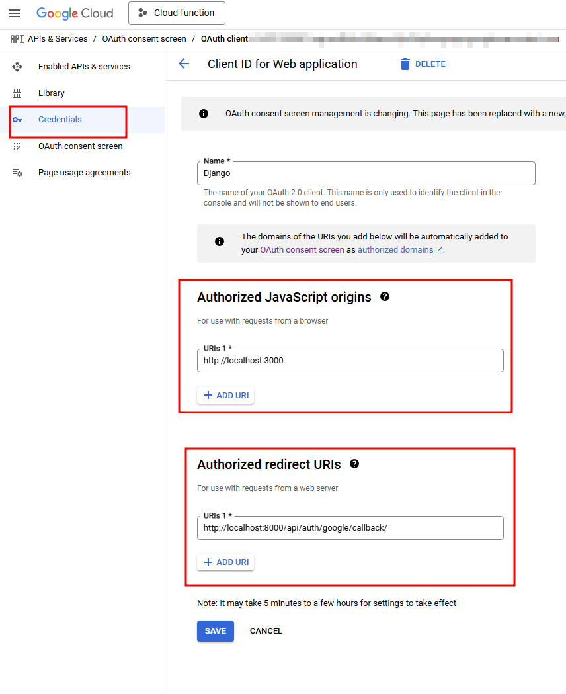

# Project Name

This project is a web application built with a Django backend and a Next.js frontend.

## Table of Contents

- [Setup](#setup)
    - [Google Cloud Platform](#google-cloud-platform) 
    - [Secrets](#secrets)
    - [Backed](#backend)
    - [Frontend](#frontend)
- [Dependencies](#dependencies)
- [Running the Project](#running-the-project)
- [Code Workflow](#code-workflow)
- [API Documentation](#api-documentation)


## Setup

### Google Coud Platform

Consent screen configuration is simple and can be looked up in the Internet. However, the following configuration must be ensured is set right as per the screenshot.



### Secrets

| Secret Name               | Description                          | Frontend/Backend | Necessity |
|---------------------------|--------------------------------------|------------------|-----------|
| DJANGO_SECRET_KEY         | Django secret key for cryptographic signing | Backend          | Required  |
| JWT_SECRET_KEY                | Secret key for JWT authentication    | Backend          | Required  |
| NEXT_PUBLIC_DJANGO_URL       | URL for the backend API              | Frontend         | Required  |
| GOOGLE_REDIRECT_URI       | Google OAuth redirect URI            | Backend          | Required  |
| GOOGLE_CLIENT_SECRET_JSON | Google OAuth client secret JSON      | Backend          | Required  |
| OAUTHLIB_INSECURE_TRANSPORT | Allow OAuthlib to use HTTP (for local development) | Backend | Optional  |
| FRONTEND_URL              | URL for the frontend application     | Backend         | Required  |


### Backend

1. **Install Poetry**: Poetry is used for dependency management. You can install it from [here](https://python-poetry.org/docs/#installation).

2. **Install Dependencies**: Navigate to the `backend` directory and run:
    ```sh
    poetry install
    ```

3. **Apply Migrations**: Run the following command to apply migrations:
    ```sh
    poetry run python manage.py migrate
    ```

4. **Run the Server**: Start the Django development server:
    ```sh
    poetry run python manage.py runserver
    ```

### Frontend

1. **Install Node.js**: Ensure you have Node.js installed. You can download it from [here](https://nodejs.org/).

2. **Install Dependencies**: Navigate to the [frontend](../../tree/main/frontend) directory and run:
    ```sh
    npm install
    ```

3. **Run the Development Server**: Start the Next.js development server:
    ```sh
    npm run dev
    ```

## Dependencies

### Backend

- **Django**: A high-level Python web framework.
- **djangorestframework**: A powerful and flexible toolkit for building Web APIs.
- **django-cors-headers**: A Django application for handling the server headers required for Cross-Origin Resource Sharing (CORS).
- **djangorestframework-simplejwt**: A minimal JSON Web Token authentication plugin for Django REST Framework.
- **poetry**: Python dependency management and packaging made easy.

### Frontend

- **Next.js**: A React framework for production.
- **React**: A JavaScript library for building user interfaces.
- **Tailwind CSS**: A utility-first CSS framework.
- **@nextui-org/react**: A React UI library.
- **framer-motion**: A library for animations in React.

## Running the Project

### Backend

To run the backend server, navigate to the [backend](../../tree/main/backend) directory and run:
```sh
poetry run python manage.py runserver
```

## API Documentation

For detailed information about the API routes, refer to the [API Documentation](backend/readme.md#api-documentation).